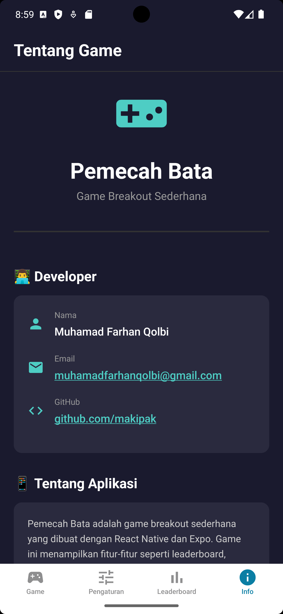
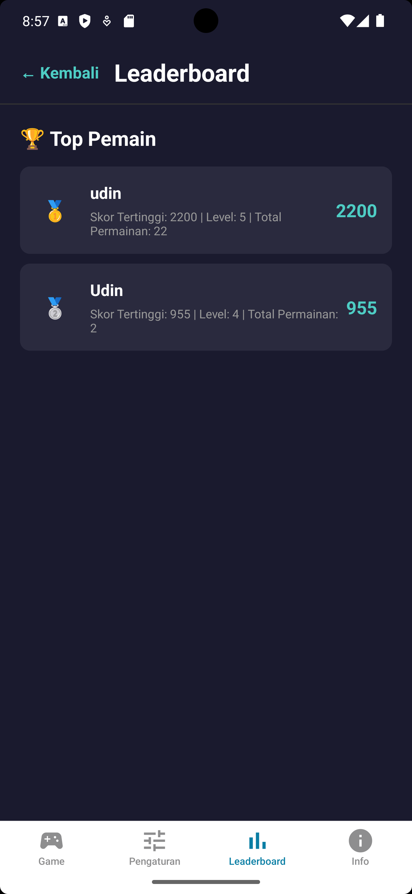
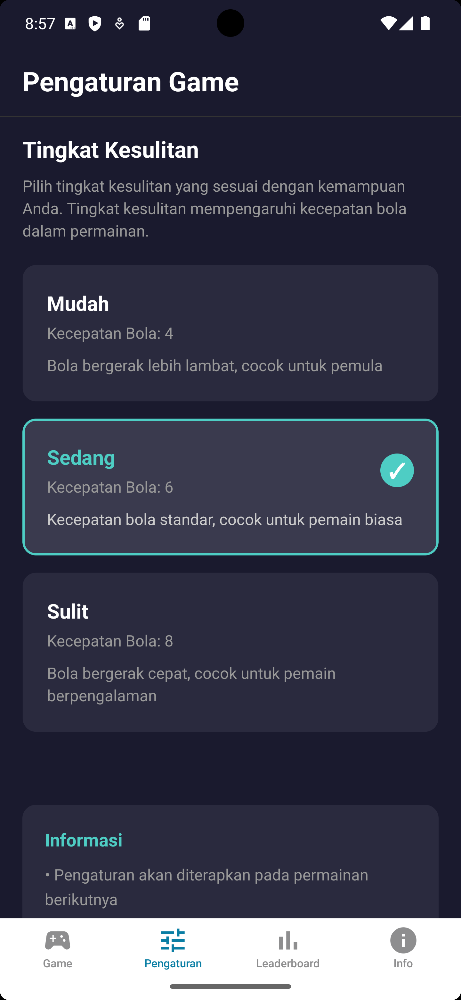

# 🧱 Pemecah Bata - Game Breakout Sederhana


Selamat datang di **Pemecah Bata**, sebuah game _breakout_ klasik yang dibuat dengan React Native dan Expo. Hancurkan semua bata untuk memenangkan permainan, kumpulkan skor tertinggi, dan jadilah yang terbaik di papan peringkat!

## 📜 Daftar Isi

- [Fitur Utama](#-fitur-utama)
- [Tangkapan Layar](#-tangkapan-layar)
- [Teknologi yang Digunakan](#-teknologi-yang-digunakan)
- [Instalasi dan Menjalankan Proyek](#-instalasi-dan-menjalankan-proyek)
- [Struktur Proyek](#-struktur-proyek)
- [Developer](#-developer)
- [Lisensi](#-lisensi)

## ✨ Fitur Utama

Game ini dilengkapi dengan berbagai fitur untuk meningkatkan pengalaman bermain:

- **🏆 Leaderboard**: Bersaing dengan pemain lain untuk mendapatkan skor tertinggi. Data disimpan secara lokal di perangkat Anda.
- **⚙️ Pengaturan Kesulitan**: Pilih tingkat kesulitan yang sesuai dengan kemampuan Anda (Mudah, Sedang, Sulit).
- **📊 Riwayat Permainan**: Lihat riwayat permainan Anda sebelumnya, termasuk skor dan tingkat kesulitan.
- **👤 Kustomisasi Nama**: Ubah nama pemain Anda kapan saja.
- **⚡ Power-Up**: Dapatkan power-up untuk memperpanjang pemantul (paddle) dan memudahkan permainan.
- **❤️ Sistem Nyawa**: Anda memiliki beberapa nyawa untuk menyelesaikan setiap level.
- **🧱 Blok Spesial**: Hadapi blok silver yang lebih kuat dan membutuhkan dua kali pukulan untuk hancur.
- **💾 Penyimpanan Lokal**: Semua data pemain, skor, dan pengaturan disimpan secara lokal.

## 📸 Tangkapan Layar

| Halaman Utama | Papan Peringkat | Pengaturan |
| :---: | :---: | :---: |
|  |  |  |

## 🛠️ Teknologi yang Digunakan

- **[React Native](https://reactnative.dev/)**: Kerangka kerja untuk membangun aplikasi mobile cross-platform.
- **[Expo](https://expo.dev/)**: Platform untuk membuat aplikasi universal React dengan lebih mudah.
- **[TypeScript](https://www.typescriptlang.org/)**: Superset JavaScript yang menambahkan tipe statis.
- **[Expo File System](https://docs.expo.dev/versions/latest/sdk/filesystem/)**: Untuk manajemen data pemain dan skor secara lokal.

## 🚀 Instalasi dan Menjalankan Proyek

Ikuti langkah-langkah berikut untuk menjalankan proyek ini di lingkungan pengembangan lokal Anda.

### Prasyarat

- [Node.js](https://nodejs.org/en/) (versi LTS direkomendasikan)
- [Git](https://git-scm.com/)
- Aplikasi **Expo Go** di perangkat seluler Anda (Android/iOS)

### Langkah-langkah

1.  **Clone repositori ini:**
    ```bash
    git clone https://github.com/makipak/game-pemecah_bata-sederhana.git
    cd game-pemecah_bata-sederhana
    ```

2.  **Install dependensi proyek:**
    ```bash
    npm install
    # atau jika Anda menggunakan yarn
    # yarn install
    ```

3.  **Jalankan server development Expo:**
    ```bash
    npx expo start
    ```

4.  **Buka aplikasi di perangkat Anda:**
    - Pindai (scan) QR code yang muncul di terminal menggunakan aplikasi Expo Go.
    - Aplikasi akan termuat dan siap untuk dimainkan.

## 📁 Struktur Proyek

```
game-pemecah_bata-sederhana/
├── app/                # Direktori utama untuk semua layar dan logika navigasi (Expo Router)
│   ├── (game)/         # Layar-layar yang berhubungan dengan gameplay
│   ├── (tabs)/         # Layar-layar utama dengan navigasi tab (Game, Info, Leaderboard)
│   └── _layout.tsx     # Layout utama aplikasi
├── assets/             # File statis seperti gambar, font, dan screenshot
│   └── screenshot/     # Tangkapan layar aplikasi
├── components/         # Komponen UI yang dapat digunakan kembali
├── constants/          # Nilai konstan (warna, ukuran, dll.)
├── context/            # React Context untuk manajemen state global
├── types/              # Definisi tipe TypeScript
└── README.md           # File yang sedang Anda baca
```

## 👨‍💻 Developer

Proyek ini dikembangkan dan dikelola oleh:

- **Nama**: Muhamad Farhan Qolbi
- **GitHub**: [@makipak](https://github.com/makipak)
- **Email**: [muhamadfarhanqolbi@gmail.com](mailto:muhamadfarhanqolbi@gmail.com)

Jangan ragu untuk menghubungi jika ada pertanyaan atau masukan!

## 📄 Lisensi

Proyek ini dilisensikan di bawah [Lisensi MIT](LICENSE).

---

Dibuat dengan ❤️ menggunakan React Native & Expo.